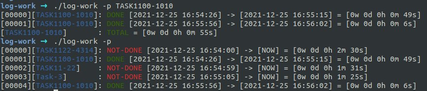

# Task-based Work Logging
 

## Overview
 - This repository contains task-based log working. It looks like this:

## Maintainer
 - **Kadir Yanık** - _kdrynkk@gmail.com_

**Free Software, Hell Yeah!**
